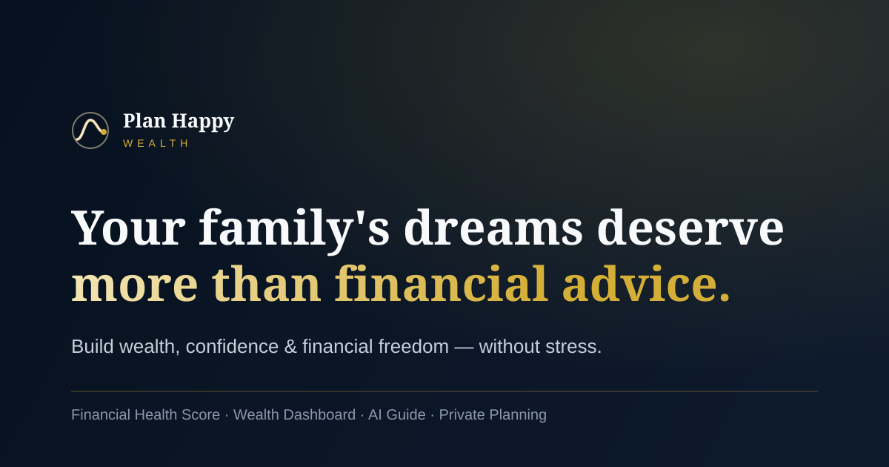

# Plan Happy Wealth

> Your family's dreams deserve more than financial advice.

A premium, emotionally-driven financial-wellness experience — built to feel like Apple, Stripe, Linear, Ramp, Wealthfront, and Morgan Stanley Private Banking, combined. It sells **outcomes, not products**: wealth, confidence, and financial freedom without the stress.

This is not a typical financial-advisor website. It's a cinematic, interactive product.



---

## ✦ Highlights

- **Cinematic hero** — full-viewport, parallax, subtle Three.js constellation, dual CTAs.
- **Interactive Wealth Journey** — pick a goal (education, retirement, home, wealth, protection, freedom); content morphs with elegant transitions.
- **Financial Health Score** — a six-question assessment with a real, deterministic scoring engine producing an overall score plus Protection / Investment / Retirement / Tax sub-scores on animated gauges, with personalized recommendations.
- **Netflix-style success stories** — testimonials reframed as Before → Journey → Outcome case studies, with a video-ready modal.
- **Premium dashboard demo** — net-worth chart, goal progress, retirement readiness gauge, asset allocation donut, financial-freedom tracker.
- **Magazine-style Education Hub** — filterable, editorial, CMS-ready.
- **AI Financial Guide** — futuristic, trustworthy chat with a zero-config scripted knowledge base and a drop-in LLM integration point.
- **Conversion-optimized** — three psychologically-placed paths (Book Consultation / Health Assessment / Wealth Blueprint).

---

## ✦ Tech stack

| Layer | Choice |
| --- | --- |
| Framework | **Next.js 15** (App Router, RSC) |
| Language | **TypeScript** (strict) |
| UI | **React 19** |
| Styling | **Tailwind CSS** + custom design tokens |
| Motion | **Framer Motion** + **GSAP** (ScrollTrigger) |
| 3D | **Three.js** (subtle, lazy-loaded, decorative only) |
| Type | Self-hosted **Fraunces** (display) + **Inter** (sans) + **JetBrains Mono** |
| CMS | **Sanity** (Education Hub) — scaffolded |
| Data | **Supabase** (lead capture, assessments) — scaffolded |

> Sanity and Supabase are wired but optional. **The app runs fully on local/mock data with zero keys** — add credentials to `.env.local` to switch them on.

---

## ✦ Getting started

```bash
# 1. Install
npm install

# 2. (optional) configure backends
cp .env.example .env.local   # fill in only what you need

# 3. Develop
npm run dev                  # http://localhost:3000

# 4. Production build
npm run build && npm start
```

Requires Node 18.18+ (Node 20 LTS or 22 recommended).

### Scripts

| Script | Does |
| --- | --- |
| `npm run dev` | Start the dev server |
| `npm run build` | Production build (type-checked) |
| `npm start` | Serve the production build |
| `npm run lint` | ESLint |
| `npm run typecheck` | `tsc --noEmit` |

---

## ✦ Environment

Everything is optional — see [`.env.example`](.env.example). Without keys, lead capture accepts optimistically and logs server-side, the AI guide uses its scripted brain, and the Education Hub uses local seed content.

```bash
NEXT_PUBLIC_SITE_URL=
NEXT_PUBLIC_SUPABASE_URL=
NEXT_PUBLIC_SUPABASE_ANON_KEY=
SUPABASE_SERVICE_ROLE_KEY=
NEXT_PUBLIC_SANITY_PROJECT_ID=
SANITY_API_READ_TOKEN=
AI_GUIDE_API_KEY=
```

To enable lead storage: run [`supabase/schema.sql`](supabase/schema.sql) in your Supabase project, then add the keys above.
To enable the CMS: `npx sanity@latest init`, point it at [`sanity/`](sanity/), and add the project id.

---

## ✦ Project structure

```
plan-happy-wealth/
├── src/
│   ├── app/                 # App Router: layout, page, api routes, SEO
│   ├── components/
│   │   ├── layout/          # Navbar, Footer, Logo
│   │   ├── sections/        # The 9 homepage sections
│   │   ├── ui/              # Button, GlassCard, Gauge, Counter, …
│   │   ├── motion/          # Reveal (Framer), GsapReveal (GSAP), Parallax
│   │   └── three/           # AuroraField (lazy Three.js)
│   ├── hooks/               # useCountUp
│   └── lib/
│       ├── data/            # Seed content (journey, stories, education, …)
│       ├── scoring.ts       # Financial Health Score engine (pure, testable)
│       ├── supabase/        # client + server helpers
│       └── sanity/          # client + queries
├── sanity/                  # Studio schemas + config
├── supabase/                # schema.sql
├── docs/                    # The 12 strategy & design deliverables
└── public/                  # favicon, OG, manifest assets
```

Full annotated tree: [`docs/11-folder-structure.md`](docs/11-folder-structure.md).

---

## ✦ The 12 deliverables

All in [`docs/`](docs/):

1. [Information Architecture](docs/01-information-architecture.md)
2. [Homepage Wireframe](docs/02-homepage-wireframe.md)
3. [UX Strategy](docs/03-ux-strategy.md)
4. [Design System](docs/04-design-system.md)
5. [Color Palette](docs/05-color-palette.md)
6. [Typography System](docs/06-typography-system.md)
7. [Motion System](docs/07-motion-system.md)
8. [Component Library](docs/08-component-library.md)
9. [Conversion Strategy](docs/09-conversion-strategy.md)
10. [Next.js Implementation Plan](docs/10-implementation-plan.md)
11. [Folder Structure](docs/11-folder-structure.md)
12. [Production Code Examples](docs/12-code-examples.md)

---

## ✦ Performance & accessibility

- Three.js and GSAP ScrollTrigger are **dynamically imported** — off the critical path. Homepage First Load JS ≈ **209 kB**.
- Self-hosted fonts (no layout shift, no Google round-trip).
- `prefers-reduced-motion` honored across every animation.
- Semantic landmarks, skip-link, gold focus rings, ARIA on interactive widgets, AA-contrast palette.
- SEO: metadata, Open Graph, JSON-LD `FinancialService`, `sitemap.xml`, `robots.txt`, web manifest.

---

## ✦ Publish to GitHub

This repo is ready to push to **https://github.com/KunalDSoni/PlanHappyWealth**:

```bash
cd plan-happy-wealth
git init
git add .
git commit -m "feat: Plan Happy Wealth — premium financial wellness platform"
git branch -M main
git remote add origin https://github.com/KunalDSoni/PlanHappyWealth.git
git push -u origin main
```

If the remote already has commits, use `git pull --rebase origin main` first (or `git push -u origin main --force` to overwrite an empty repo).

---

## ✦ Deploy

### Vercel (recommended — full features)

Import the repo, add any env vars, deploy. Keeps the optional server API routes (LLM hand-off, Supabase lead storage). Any Node host works too: `npm run build && npm start`.

### GitHub Pages (static)

The site also ships as a fully static export. The AI guide runs **client-side** and the consultation form is static-safe (optional [Formspree](https://formspree.io) via `NEXT_PUBLIC_FORMSPREE_ID`), so nothing visibly breaks without a server.

1. Push to `main` — [`.github/workflows/deploy.yml`](.github/workflows/deploy.yml) builds and deploys automatically.
2. In the repo: **Settings → Pages → Source: GitHub Actions** (one-time).
3. Live at **https://KunalDSoni.github.io/PlanHappyWealth/**.

The workflow sets `GITHUB_PAGES=true` (→ `output: export`, base path `/PlanHappyWealth`, `.nojekyll`) and removes `src/app/api` (static export can't host route handlers). To preview the export locally:

```bash
GITHUB_PAGES=true npm run build   # outputs to ./out
npx serve out                     # then open the /PlanHappyWealth/ path
```

> Renaming the repo? Update `REPO` in `next.config.mjs` so the base path matches.

---

## ✦ Disclaimer

All figures, projections, statistics, and stories are **illustrative** and for product-demonstration purposes only. They are not investment, tax, or legal advice. Replace seed content and metrics with your verified, compliant numbers before going live.

---

© Plan Happy Wealth. Crafted as a flagship financial-wellness experience.
